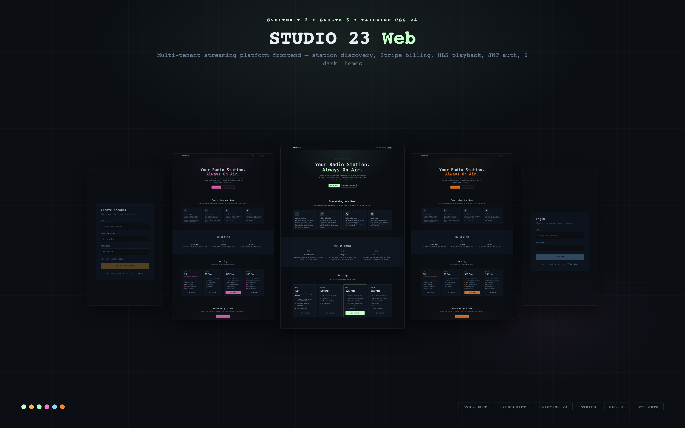

# STUDIO 23 — Web Frontend

Public-facing web application for the STUDIO 23 streaming platform. Listeners discover stations, browse content, manage subscriptions, and listen to live streams — all from the browser.



## Architecture

```
┌───────────────────────────────────────────────┐
│              SvelteKit App                     │
│                                                │
│  (marketing)     (auth)        (app)           │
│  ┌──────────┐  ┌──────────┐  ┌──────────────┐ │
│  │ Landing   │  │ Login    │  │ Explore      │ │
│  │ Pricing   │  │ Register │  │ Station      │ │
│  │           │  │          │  │ Dashboard    │ │
│  │           │  │          │  │ Billing      │ │
│  │           │  │          │  │ Profile      │ │
│  └──────────┘  └──────────┘  └──────────────┘ │
│                       │                        │
│              ┌────────▼────────┐               │
│              │   API Client    │               │
│              │  (apiFetch)     │               │
│              └────────┬────────┘               │
└───────────────────────┼────────────────────────┘
                        │ HTTP/JSON
               ┌────────▼────────┐
               │  Control Plane  │
               │   (Go API)     │
               └─────────────────┘
```

## Tech Stack

| Layer | Technology |
|-------|------------|
| Framework | SvelteKit 2 (Svelte 5) |
| Language | TypeScript |
| Styling | Tailwind CSS v4 |
| Bundler | Vite 7 |
| Audio | HLS.js (live stream playback) |
| Auth | JWT (access + refresh tokens) |
| Payments | Stripe Checkout + Customer Portal |
| Deployment | Node adapter (Docker / any Node host) |

## Features

- **Station discovery** — Browse live radio stations with real-time listener counts
- **Live audio player** — HLS stream playback with volume control and persistent player bar
- **User authentication** — Email/password with JWT, automatic token refresh, session expiry handling
- **Station management** — Create and manage your own 24/7 radio station
- **Billing & subscriptions** — Stripe-powered tier upgrades (Free → Starter → Pro → Studio)
- **Theme system** — Multiple dark themes with smooth transitions
- **Responsive design** — Mobile-first layout

## Quick Start

```bash
# Install dependencies
npm install

# Configure API endpoint
cp .env.example .env
# Edit .env — set PUBLIC_CP_API_URL to your Control Plane API

# Development
npm run dev

# Production build
npm run build
npm run preview
```

## Configuration

| Variable | Default | Description |
|----------|---------|-------------|
| `PUBLIC_CP_API_URL` | `http://localhost:8085` | Control Plane API URL |
| `PUBLIC_TENANT_DOMAIN` | `localhost` | Base domain for tenant station URLs |

## Project Structure

```
src/
  lib/
    api/
      client.ts           API client with auth, token refresh, error handling
    components/
      Button.svelte       Reusable button (link/button variants)
      FormInput.svelte    Form input with label and validation
      Nav.svelte          Top navigation bar
      PlayerBar.svelte    Persistent audio player
      StationCard.svelte  Station card for explore grid
      PricingCard.svelte  Pricing tier card
      VolumeSlider.svelte Audio volume control
      ThemeSwitcher.svelte Theme picker dropdown
      ...                 10+ components total
    stores/
      auth.svelte.ts      Auth state (login, register, refresh, logout)
      player.svelte.ts    Audio player state (play, pause, volume)
      stations.svelte.ts  Station list with API fetch
      theme.svelte.ts     Theme persistence
    types.ts              TypeScript interfaces
    data/themes.ts        Theme definitions
  routes/
    (marketing)/          Landing page, pricing
    (auth)/               Login, register
    (app)/
      explore/            Station discovery grid
      stations/[slug]/    Individual station page + player
      dashboard/          Station management
      dashboard/billing/  Subscription management (Stripe)
      dashboard/create/   Station creation wizard
      profile/            User profile
```

## Related Projects

| Project | Description |
|---------|-------------|
| [controlplane](https://github.com/Awis13/controlplane) | Go API — auth, tenants, billing, provisioning |
| [freeRadio](https://github.com/Awis13/freeRadio) | Streaming engine — AutoDJ, video compositing, HLS/RTMP |

## License

MIT
